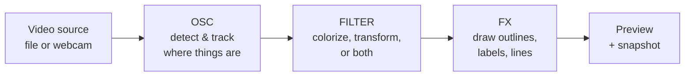

# FluxKit — Overview

> A friendly tour of the project for product managers, designers, and anyone curious who isn't an engineer. No code. No file paths. Just what FluxKit is, how it works, and where you can help.

If you only have 30 seconds, read [What is FluxKit](#what-is-fluxkit) and [How a user experiences it](#how-a-user-experiences-it). The rest is here when you need it.

---

## What is FluxKit

FluxKit is a **video instrument that runs in your browser**. You drop in a video clip or open your webcam, and FluxKit watches the picture for movement, bright spots, edges, or other "interesting" places. It draws shapes around them in real time. You can colorize those regions, replace them with thermal-camera palettes, or transform the whole frame with effects that look like cellular life, propagating waves, ASCII art, oxidized metal, or shattered glass.

The closest reference points: a guitar pedalboard for video, a TouchDesigner patch for people who don't want to learn TouchDesigner, a VJ tool that doesn't pretend to be Resolume.

**Three things to remember:**

1. **It runs entirely in the browser.** No account, no upload, no AI. Your video never leaves your laptop.
2. **The core gesture is "play with knobs and watch the picture change."** Like a synthesizer, but the sound is a picture.
3. **It's a single-page web app.** Open it, use it, close the tab. The settings persist locally for next time.

---

## Who it's for

| Persona | What they want from FluxKit |
|---|---|
| **The VJ / live visual artist** | Quick, expressive visuals for clubs, sets, livestreams. Wants to record a clip, drop it in their set, move on. |
| **The generative-art tinkerer** | Likes pretty math. Wants to play with detection algorithms and effects until something surprises them. |
| **The curious creator** | Saw a TouchDesigner reel and thought "I want to make that, but I don't want to learn a node graph." |

These are the three personas in `PRODUCT.md`. Everything in the product is built to serve at least one of them.

**Who it is *not* for**: people who want a one-click filter app, AI-generated video, or a polished consumer product. FluxKit is intentionally an instrument — there's a learning curve, and that's the point.

---

## How a user experiences it

A typical session, scene by scene:

1. **Open the page.** Dark sidebar on the left, big preview area on the right. The sidebar is empty until you load something.
2. **Load video.** Drag a clip onto the window, or click "Upload Video" / "Open Camera." A pink halo appears during drag.
3. **The picture starts moving.** FluxKit immediately starts watching the video for blobs of motion. Outlines appear over moving things.
4. **Tweak the OSC section.** This is the top of the sidebar. Pick a detection mode (motion, brightness, color, edges, etc.). Adjust how sensitive the detector is, how many blobs to track at once, how much to smooth their motion.
5. **Pick a Filter.** Fourteen filter buttons. Some only paint inside the blob outlines (Inv, Thermal). Most replace the whole frame with a stylized look (Voronoi cells, cellular automata, ASCII, wave ripples, oxidized metal, false-color palettes...). Each filter reveals 3-4 knobs underneath that fine-tune it.
6. **Tweak the FX section.** Bottom of the sidebar. This controls how the blob outlines look — shape (rectangle, circle, rounded, diamond), region style (basic / labeled / framed), color, line thickness, label font size, connection lines between blobs.
7. **Hit Snap to save a frame.** PNG download. (Video clip recording is on the roadmap; not built yet.)
8. **Close the tab.** Settings auto-save. Reopen later and everything's where you left it.

That's the whole product. There are no menus, no modals, no settings page, no account.

---

## How it works (architecture in plain language)

The signal flow is borrowed from analog synthesizers — three stages in a row, left to right.

### Stage 1 — OSC (the "where")

OSC is short for *oscillator* — borrowed from synth language because it's the source. In FluxKit, OSC is responsible for finding what's interesting in the video.

It does this with a **blob detector** that scans every frame, looking for places where one of six signals peaks:

- **Motion** — pixels that changed since the last frame (the default — anything that moves)
- **Luma** — bright spots
- **Dark** — silhouettes / shadows
- **Saturation** — vivid colored objects
- **Edge** — boundaries between things
- **Sharp** — areas of crisp detail / focus

Once the detector finds candidates, a **Kalman filter tracker** stitches them together across frames so each blob has a stable identity (Object 1, Object 2, ...). The tracker is what makes the outlines look smooth and persistent instead of flickering on and off every frame.

### Stage 2 — FILTER (the "what it looks like")

The 14 filter buttons. Pick one and the picture transforms.

There are two kinds of filters:

- **Per-blob filters** (Inv, Thermal) — only paint *inside* the blob outlines. The rest of the frame is untouched.
- **Full-frame filters** (the other 12) — replace the entire video with a stylized look. The blob outlines still draw on top.

Each filter has its own card that appears below the picker, with 3-4 knobs that tune it. Picking a different filter swaps the card. Hover any knob for ~350ms and a tooltip explains what it does.

### Stage 3 — FX (the "how the outlines look")

This is the part that draws the boxes, labels, and connection lines on top of the picture. You control:

- **Shape** of the box (rectangle, circle, rounded rectangle, diamond)
- **Region style** (just an outline + score, "Object N" label, or full editor-style frame with handles)
- **Color** of the outline (8 preset swatches + custom picker)
- **Stroke width** of the lines
- **Connection lines** between tracked blobs (controlled by a density knob)
- **Blob size** scale (so the box can be smaller or larger than the actual detected region)
- **Font size** of the labels

### What makes this different from a generic video filter app

The order matters. **The blob system runs first**, the filter runs second. So a Voronoi filter applied to a video of a person walking doesn't just make Voronoi cells everywhere — it makes Voronoi cells *and* tracks the person walking through them, with outlines that follow the person across the frame. The two systems compose.

This is also why the product can pivot to lots of different aesthetics by adding new detection modes (different things to track) or new filters (different ways to render), without rewriting the underlying engine.

---

## The pieces (vocabulary for non-engineers)

When you talk to engineering about FluxKit, these are the words that come up most:

| Word | What it means in FluxKit |
|---|---|
| **Blob** | A region of the video the detector flagged as interesting. Has a position, size, and ID. |
| **Detection mode** | Which signal the detector watches for (motion, luma, dark, sat, edge, sharp). |
| **Tracker** | The system that keeps a blob's identity stable across frames so outlines don't flicker. Uses something called a Kalman filter under the hood. |
| **Knob** | The circular SVG control with a pointer. Drag vertically to change the value. |
| **Filter** | One of the 14 visual effects. Pick one at a time. |
| **Effect card** | The panel that appears under the filter picker with that filter's specific knobs. |
| **OSC / FILTER / FX** | The three stages of the signal flow (detect / colorize / draw outlines). Each has its own colored divider in the sidebar. |
| **Per-blob vs full-frame** | Whether a filter paints only inside the blob regions (per-blob) or replaces the whole picture (full-frame). |
| **Snap** | Save the current frame as a PNG. |
| **OKLCH** | The color system the visual design uses (lets the team pick colors that look perceptually consistent across hues). |
| **Stage divider** | The colored bars in the sidebar that separate OSC, FILTER, and FX. Amber / violet / teal. |

---

## What's built and what's not

This matters for prioritization conversations. The detailed engineering audit lives in `lumisynthprd.md`; this is the friendly summary.

### Built and working

- All three stages of the signal flow (OSC, FILTER, FX)
- 6 detection modes
- 14 filter effects
- Real-time blob tracking with smoothing
- The full visual design system (palette, typography, components, named rules — see `DESIGN.md`)
- Settings auto-save between sessions
- Snapshot (PNG export)
- Keyboard shortcuts for power users
- Hover tooltips on every filter and effect knob
- Drag-and-drop video loading
- Webcam support

### Built but partial

- Mobile layout exists but desktop is the primary surface
- The visual chrome went through several rounds; it's intentionally flat and dark — not the original "glassmorphism" vision

### Not built (the active backlog, in roughly priority order)

1. **Pipeline rewrite** so filters can chain together (currently one at a time)
2. **Ramp editor** — a draggable color gradient for fully custom palettes
3. **Video clip recording** — currently you can only save a single frame; recording short clips is the #1 ask from the VJ persona
4. **FX rack** — multiple effects layered like a guitar pedalboard
5. **Live thumbnails** on the filter picker so each button shows what it actually does
6. **Save / load patches** as a portable file (currently only auto-saved locally)
7. **More structure effects** (Halftone, Edge, Threshold, Pixelate)
8. **Color-blind safe overlay defaults** — the 8 swatch colors haven't been audited for protanopia / deuteranopia yet

### What we deliberately decided NOT to do

These are documented decisions, not oversights. Each is logged in `PRD_DECISIONS.md`.

- No Next.js, TypeScript, Tailwind, or shadcn — vanilla JS keeps the project light and the look distinctive
- No accounts, no servers, no analytics, no AI — runs entirely on your machine
- No glassmorphism / blurred panels — they conflict with the "instrument" feel
- No revenue model right now — positioned as a portfolio / personal tool

---

## How you can help (specific to non-engineering contributors)

Concrete things that move the project forward and don't require touching code:

### If you're a product manager

- **Sharpen the personas.** The three in `PRODUCT.md` are first-draft. Test them against real users — does the VJ persona still hold up if we talk to actual VJs? Does the "tinkerer" need a separate set of features?
- **Prioritize the backlog.** The list above is the engineer's best guess at impact order. A PM lens on what unlocks the most user value (especially #1 vs #3 — pipeline rewrite vs clip recording) would be useful.
- **Define success.** What does "this product is working" look like? Number of patches saved? Length of a typical session? Time-to-first-snap? None of this is measured today.
- **Source use cases.** Real footage from real users. The detection algorithms behave very differently on dance footage vs nature footage vs webcam vs screen recordings.

### If you're a designer

- **Audit the swatch palette for color blindness.** This is a known gap, listed in the backlog.
- **Critique the OSC / FILTER / FX color coding.** Currently amber / violet / teal. Are those the right hues for the metaphor? Do they read as "signal flow" or just as decoration?
- **Propose new filter ideas.** Each filter is a small visual world. What aesthetic isn't represented? (See the existing 14 — gaps include risograph, halftone, scanline, glitch / datamosh, painterly.)
- **Iterate on the empty state.** When you first open FluxKit with no video loaded, the sidebar is mostly inert. There's room to teach the user what to do next.
- **Improve the keyboard-shortcut help panel.** The `?` panel is functional but plain. It's a discoverability surface.

### If you're a writer / strategist

- **Write the actual copy.** Most labels in the UI are short and engineer-flavored ("Sensitivity", "Influx", "Sep"). A writer's pass would help — without losing the instrument-style terseness.
- **Tagline.** `PRODUCT.md` lists candidates ("Play your video like an instrument") but nothing has been chosen.
- **The website.** There isn't one. When there is, someone needs to write it.

### If you just want to play and report what breaks

- Drop in unusual videos. Try edge cases — extremely dark footage, footage with sudden cuts, webcam in poor lighting, screen recordings, footage with text in it.
- Try every detection mode on every type of footage. Tell us when it does something surprising (good or bad).
- Try every filter. Tell us if a filter looks identical to another filter at certain knob settings (means the knobs aren't mapped well).
- Tell us when the product confuses you. That's a documentation bug or a UX bug, and both are worth fixing.

---

## Where to look next

| If you want to... | Read this |
|---|---|
| Install and run the project locally | `README.md` (the developer-facing readme) |
| Understand the product strategy in detail | `PRODUCT.md` (personas, principles, brand voice) |
| Understand the visual design system in detail | `DESIGN.md` + `DESIGN.json` (palette, typography, components, named rules) |
| See the full engineering audit of what's built vs the original spec | `lumisynthprd.md` (the implementation status section at the top) |
| See the log of "we deliberately did NOT do this" decisions | `PRD_DECISIONS.md` |

If something in this overview is wrong, unclear, or stale — that's a documentation bug, please report it. The goal is for someone to read this once and then be able to participate in product conversations without needing to read the code.
